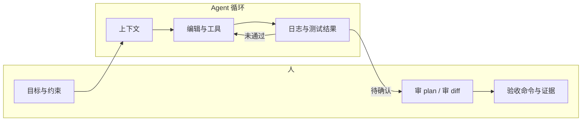

# Learning Agents 学习笔记

本文整理 **Cursor 与同类 IDE 中的 AI Agent** 能力分层、选用顺序与可验收提示习惯，并对照本仓库 **EngineLink + Unreal MCP** 的双 MCP 实践。六个工具契约见 [mcp-tools.md](./mcp-tools.md)。

**主要参考（2025–2026）：**

- [Cursor Agents: Local, Cloud, Automated…](https://www.learncursor.dev/learn/cursor-agents)（Learn Cursor）
- [Cursor Subagents](https://cursor.com/docs/subagents)
- [Cursor Agent Skills](https://cursor.com/help/customization/skills)
- [Microsoft AI Agents for Beginners](https://microsoft.github.io/ai-agents-for-beginners/)（通用 Agent 设计模式与 MCP）

---

## 1. 心智模型：Agent 在做什么

**Agentic coding** 不是「模型替你写完所有代码」，而是你把 **目标、约束、验证方式** 交给 Agent，由它在循环里：

1. 检索上下文（代码库、规则、Skill、MCP 工具）
2. 规划或拆步（可选但重要）
3. 改文件、跑终端、调用外部工具
4. 根据输出迭代，直到满足你定义的完成条件

与 **Ask / Chat（只读）** 对比：Agent 能 **写盘、执行命令、改仓库状态**；因此「审批 diff」「定义验收命令」不是形式主义，而是控制 blast radius 的主要手段。



---

## 2. 能力分层：Rules / Skills / Commands / Subagents

四类产物解决不同问题：**何时触发** 比 **写什么字** 更重要。

| 产物 | 存放位置（典型） | 谁触发 | 适合内容 |
|------|------------------|--------|----------|
| **Rules** | `.cursor/rules/*.mdc`、`AGENTS.md` | 始终 / 按 glob / Agent 判断 / 手动 @ | 短约束：命名、目录、禁止项、引擎版本 |
| **Skills** | `.cursor/skills/`、`.agents/skills/`、插件 marketplace | `/技能名` 或 Agent 按需加载 | 多步骤 SOP：MCP Inspect→Save→Verify、规格写作 |
| **Commands** | `.cursor/commands/`（逐步迁移到 Skills） | `/command`；Agent 也可能自主调用 | 可重复的一键流程 |
| **Subagents** | 内置 + `.cursor/agents/` | 主 Agent 委派 | 大块探索、长 shell 输出、浏览器 MCP、专项审查 |

**选用口诀：**

- 一句话能说清的规范 → **Rule**
- 需要按步骤执行、且团队要共享的流程 → **Skill**（优先于冗长 Rule）
- 会撑爆主会话上下文的搜索或日志 → **Subagent**（Explore / Bash / Browser 等内置角色）
- 跨应用、跨仓库的「顾问人格」→ 自定义 Subagent，**description 即子 Agent 的系统提示**

**与 EngineLink 的对应：**

- 业务项目自己的 `AGENTS.md` / `.cursor/rules`（若团队手写）：约束 **不手改 `.uasset`**、**冷构建关 Editor** 等——属于 Rules 层。EngineLink **不**生成这些文件。
- UE C++ 命名/宏/模块约定的学习材料：[ue-cpp-study-notes.md](./ue-cpp-study-notes.md)。
- `my-trex-skills` 等插件里的 `unreal-mcp`、`super-spec`：属于 Skills 层，把「先读 SKILL.md 再动刀」写进流程。
- EngineLink **不**替代 Unreal MCP：Agent 应按任务在 [architecture.md](./architecture.md) 的表格里选 **宿主 MCP** 或 **Editor MCP**，避免让 EngineLink 代理资产编辑。

---

## 3. Cursor Agent 产品面：按「工作形态」选入口

Learn Cursor 用「选最窄、能 owning 该工作的面」来选型，而不是堆功能。

| 需求 | 优先入口 | 审查产物 |
|------|----------|----------|
| 在已打开仓库里交互改代码 | **本地 Agent** | 逐步 diff + 终端输出 |
| 方案不清晰、牵涉多文件 | **Plan Mode** → 再执行 | 可编辑的计划与 to-do |
| _bounded_ 研究、与主线程改文件并行 | **Subagent / 云侧子任务** | 各子任务报告；主 Agent 综合 |
| 长时间、可离线验收的仓库变更 | **Cloud Agent** | 分支 / Draft PR |
| 已手工跑通的工作流要定时/事件触发 | **`/automate`**（先本地证明） | PR 策略、no-op 行为 |
| 合并前质量门 | **`/review`、Bugbot、Security Review** |  findings；人仍决定 merge |

**采纳顺序（实用）：**

1. 本地 Agent + **保留审批**
2. 非平凡任务默认 **先 Plan**，并 **删减多余 to-do**（如你已手动验的部分）
3. 推送前 **`/review`**
4. 工作流在本地可重复、结果可预期后，再 **Cloud / `/automate`**

**并行 Agent 注意：** 不仅看「是否改同一文件」，更要问：**两个 diff 单独 review 是否各自说得通？** 若理解 A 必须同时理解 B，应串行。

---

## 4. MCP：Agent 的「手」

**Model Context Protocol** 把 Editor/CLI/云服务封装成 Agent 可调用的工具。Cursor 在 `mcp.json` / 项目级配置里注册 server；Agent 通过 schema 发现工具并调用。

**stdio vs HTTP：**

- **stdio**：本地进程（如 `node dist/mcp-server.js --project <root>`），适合 EngineLink 这类宿主桥。
- **Streamable HTTP**：适合已运行的 Unreal Editor MCP（Doctor 使用 loopback `http://127.0.0.1:8000/mcp`）。

**设计原则（与 Microsoft「Tool Use」课一致）：**

- 工具应 **窄、可组合、可审计**（返回值含路径、exit code、run id）。
- 危险操作（clean、覆盖配置）需要 **显式 confirm** 或策略拒绝——拒绝结果出现在工具返回体；冷构建摘要写在 `Saved/EngineLink/latest-build.json`。
- **不要** 用一个大而全的 MCP 网关吞掉另一个 MCP 的职责；双 MCP 并列时由 Agent **按任务路由**。

---

## 5. 通用 Agent 设计模式（缩写）

来自 *AI Agents for Beginners* 等资料，与 Cursor 实践可直接对照：

| 模式 | 含义 | Cursor 中的体现 |
|------|------|-----------------|
| **Tool use** | LLM 决定何时调外部 API | MCP、`execute_python_code`、终端 |
| **RAG** | 检索再生成 | `@` 文件、codebase search、Subagent Explore |
| **Planning** | 先分解再执行 | Plan Mode、`/goal` |
| **Multi-agent** | 多角色协作 | Subagents、多 Cloud Agent（需边界） |
| **Reflection / 元认知** | 检查自身计划与证据 | Agent Review、验收脚本、Doctor 报告 |
| **MCP / A2A** | 标准化工具与 Agent 互发现 | MCP servers；A2A 多见于云编排场景 |

**信任与安全：** 生产向 Agent 需要 **权限最小化**、**密钥不进仓库**、**人类 merge 权**；与本仓库 `AGENTS.md`「不泄露密钥」「危险操作先确认」一致。

---

## 6. 写好 Agent 任务的五步法

（综合 Learn Cursor 与日常 UE 工程）

1. **目标 + 约束**：「实现 X，不改公开 API / 不提交 `Saved/`」。
2. **指向上下文**：`@` 关键文件；不确定文件时用 Plan，而不是盲目 @ 十几个文件塞满上下文。
3. **非平凡任务先 Plan**：执行阶段可换更快模型；计划里删掉你已手动负责的 verify 步骤。
4. **定义如何验证**：例如 `vitest`、`Run-BlasterAcceptance.ps1 -Tier L1`、`enginelink` build 返回体里的 `diagnostics`；**没有检查点的任务，结束时机由模型主观决定**。
5. **上下文卫生**：长会话后新开 chat；大块日志交给 Bash Subagent。

**Unreal 专项约束**（写在业务项目自己的 Rule / `AGENTS.md` 里；EngineLink 不代写）：

- 资产变更：**Editor 内 MCP / Python**，禁止手改 `.uasset` 二进制。
- 冷编译与 `compile_commands`：**EngineLink 或 UBT**；Editor 已打开时用 Live Coding / Editor 侧编译，而非宿主冷 build。
- PIE 运行中 **不要** 改 Content；改前先 Stop PIE。

---

## 7. 本机双 MCP 协作示例

```text
任务：C++ 改 AbilitySystem + 改对应 Blueprint 默认类

1. EngineLink：`enginelink_get_environment` 确认 Editor 关闭 → `enginelink_build`（诊断在返回体 `diagnostics`）
2. EngineLink 或手动：`enginelink_launch_editor`（或用户打开 .uproject）
3. Unreal MCP：Inspect 资产 → 修改 → Compile → Save → Verify（截图或读回属性）
4. 本地 Agent：只提交 Source + 文档；Content 以 Editor 保存后的资产为准
5. 玩法测试：在业务项目中跑 CQTest / Automation Driver（Session Frontend 或项目脚本），不要找 EngineLink 验收工具
```

共享 `taskId` / run id 可在宿主记录与 Editor 侧日志之间 **关联**，但 **无运行时依赖**——见 [architecture.md](./architecture.md)。

---

## 8. 学习与排错资源

| 主题 | 链接 |
|------|------|
| Agent 模式、Plan、Cloud、`/loop` `/automate` | [Learn Cursor — Cursor Agents](https://www.learncursor.dev/learn/cursor-agents) |
| Subagent 内置角色与自定义 | [cursor.com/docs/subagents](https://cursor.com/docs/subagents) |
| Skill 目录与 `paths` 作用域 | [cursor.com/help/customization/skills](https://cursor.com/help/customization/skills) |
| MCP 配置 | [Learn Cursor — MCP setup](https://www.learncursor.dev/)（站内 MCP 专题） |
| Agent 设计课（含 MCP、多 Agent、生产） | [ai-agents-for-beginners](https://microsoft.github.io/ai-agents-for-beginners/) |
| EngineLink 手动等价操作 | [manual-workflows.md](./manual-workflows.md) |

---

## 9. 自测清单

读完本文后，应能回答：

- [ ] Rules 与 Skills 在 **触发时机** 上差在哪里？
- [ ] 什么情况下用 Subagent 而不是主 Agent 继续搜代码？
- [ ] Plan Mode 适合 / 不适合 的任务边界是什么？
- [ ] EngineLink 与 Unreal MCP 各负责哪类操作？为何不应链式代理？
- [ ] 你如何为一次 Agent 任务写出 **可失败的** 验收命令？

---

*文档版本：2026-09-15。Cursor 功能迭代较快，以官方文档与 changelog 为准；本文侧重稳定概念与工程习惯。*
