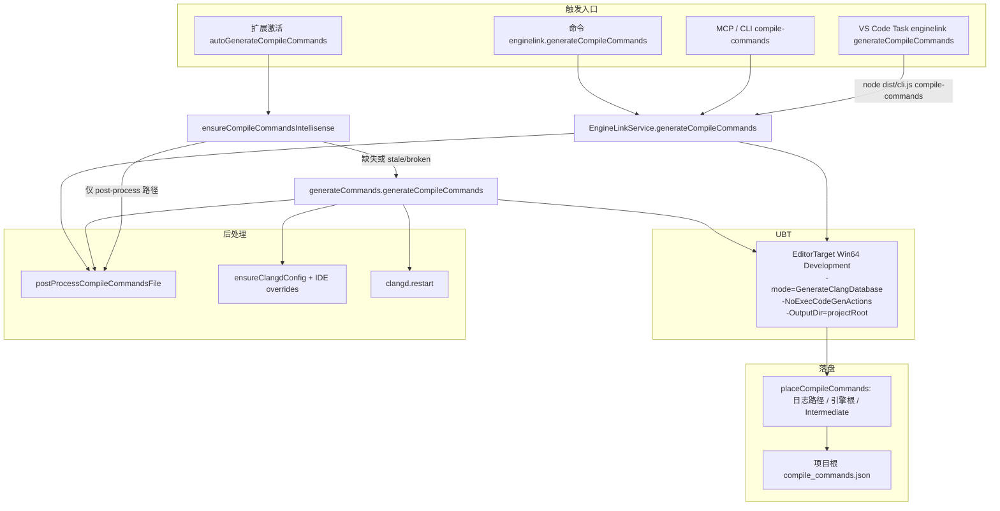

# EngineLink Review 分析备忘

本文面向后续代码审查、架构评审与 Agent 行为复盘，汇总「用户项目会被改什么」「MCP 契约边界」「源码中的非通用写法与风险」。

- 六个工具的原理、输入、输出：[mcp-tools.md](./mcp-tools.md)
- Doctor 诊断语义：[project-doctor.md](./project-doctor.md)
- 职责切分：[architecture.md](./architecture.md)
- 手动等价操作：[manual-workflows.md](./manual-workflows.md)
- Agent 选用顺序：[learning-agents.md](./learning-agents.md)
- UE C++ 命名/宏/模块速记：[ue-cpp-study-notes.md](./ue-cpp-study-notes.md)

> **契约现状：** MCP 与 CLI 对齐为 6 个入口（environment、project_doctor、build、clean、compile_commands、launch_editor）。Doctor 一次同步诊断；无 `confidence` / mode / 验收桥 / `get_run`。EngineLink 不代理 Unreal `call_tool`，不依赖 VibeUE。

---

## 1. 用户项目中的文件与目录

EngineLink **不修改** `Source/`、`Content/`、`.uproject` 本体或引擎安装目录。影响范围分为：**版本库内建议提交的配置**、**IDE/Agent 辅助文件**、**运行时产物（通常不提交）**。

### 1.1 总览

| 路径 | 谁写入 | 是否覆盖已有内容 | 典型是否进 Git | 用途 |
|------|--------|------------------|----------------|------|
| `.enginelink/project.json` | 用户 / 模板 | 否（用户维护） | 是 | 项目根、引擎覆盖、构建默认、Editor 启动参数、Unreal MCP URL |
| `.cursor/mcp.json` | Cursor 扩展激活 | 仅替换 `mcpServers.enginelink` 条目 | 视团队策略 | 注册 stdio MCP：`node <extension>/dist/mcp-server.js --project <root>` |
| `.mcp.json` | 同上 | 同上 | 视团队策略 | Claude Code 等项目级 MCP |
| `.codex/config.toml` | 同上 | 仅替换 `[mcp_servers.enginelink]` 段 | 视团队策略 | Codex MCP |
| `.vscode/settings.json` | 扩展激活 / compile 流程 | 仅替换 `<<< enginelink-managed >>>` 块 | 可选 | 指向 `${workspaceFolder}/compile_commands.json`、`clangd --query-driver` |
| `.clangd` | 扩展激活 | 仅替换 managed 块 | 可选 | 抑制 `builtin_definition`、CompileFlags、指向扩展 globalStorage 的 IDE 头文件 |
| `compile_commands.json` | UBT + 后处理 | 整文件重写（原子临时文件） | 常忽略或提交 | clangd/IDE 编译数据库（项目根，非引擎目录） |
| `Saved/EngineLink/**` | CLI / MCP / Doctor | 追加/更新 | **否** | 宿主运行记录、Doctor 报告与锁 |
| `compile_commands.json.enginelink.*.tmp` | 后处理 | 临时 | 否 | 生成过程中的临时文件，正常应被 rename 掉 |

扩展还会在 **扩展自己的 globalStorage**（不在用户仓库内）写入共享的 `clangd-ide-overrides.h`，供各项目 `.clangd` 通过绝对路径引用——这是刻意的「单副本、多项目复用」。

### 1.2 `.enginelink/project.json`

- **发现逻辑**：`findProjectRoot` 向上查找该文件；若无文件但目录内**唯一** `.uproject`，则内存中合成最小配置 `{ schemaVersion: 1, uproject: "..." }`，**不会自动创建** `project.json`。
- **schemaVersion**：必须为 `1`；`uproject` 必须是相对路径。
- **字段含义**（与 `src/core/config.ts` 一致）：

| 字段 | 用途 |
|------|------|
| `engineRoot` | 覆盖注册表/扫描不到的引擎根 |
| `build.configuration` / `targetType` / `platform` | MCP/CLI 构建与 compile DB 默认（缺省：Development / Editor / Win64） |
| `build.editorTargetName` | 显式 UBT Editor 目标名；省略时按约定名 / 主模块 / 唯一发现项解析，多义则抛错 |
| `editor.map` / `editor.args` | `launch_editor` 额外参数 |
| `unrealMcp.url` | Doctor 连接的 Streamable HTTP MCP（**仅 loopback**） |
| `unrealMcp.connectTimeoutMs` / `requestTimeoutMs` | 连接与单次工具调用超时 |
| `agentGuide` | 类型中存在，**当前源码未读取**——配置预留，审查时注意「文档写了但未实现」 |

### 1.3 `Saved/EngineLink` 运行时布局

**宿主操作记录**（`RunStore`）：

```
Saved/EngineLink/Runs/<run-id>/
  summary.json    # schema: enginelink.run.v1
  output.log      # 可选，UBT stdout+stderr
Saved/EngineLink/latest-<kind>.json   # 如 latest-build.json、latest-compile-commands.json
```

`summary.json` 含：`kind`（build / clean / compile-commands / launch）、`success`、`command`、`exitCode`、`diagnostics`（解析后的 MSVC/UBT 行）、`details`（如 `blocked: true`、`postProcess` 统计）。**被策略拒绝的操作**（Editor 已打开时 build、未 `confirm` 的 clean）仍会落盘一条 `success: false` 记录，便于审计。

**Project Doctor**（`DoctorStore`）：

```
Saved/EngineLink/Doctor/Runs/<run-id>/
  summary.json      # 与 doctor-view 同字段，外加 requestedPaths / 时间 / error
  report.md
  scan.json         # 仅当资产扫描实际跑过
Saved/EngineLink/Doctor/Runs/latest.json
Saved/EngineLink/doctor.lock        # 单项目 Doctor 互斥（含 pid、runId）
```

`doctor.lock`：独占创建（`wx`）；超过约 **240s** mtime 视为陈旧可删（与默认 180s 超时同量级）。同步 `run()` 仍用这把锁防止同项目并行诊断。

### 1.4 Cursor 扩展激活时的副作用顺序（概念）

1. 检测 `.uproject` → 引擎 → VS Build Tools  
2. 可选：自动生成/后处理 `compile_commands.json`（设置 `autoGenerateCompileCommands` 等）  
3. `ensureClangdConfig` / `ensureIdeOverridesHeader`（globalStorage）  
4. `ensureVscodeSettings`  
5. `registerProjectMcpServers`（三处客户端配置）

MCP **不由扩展常驻拉起**；由 Cursor/Codex/Claude 在需要时 spawn `mcp-server.js`。

EngineLink **不写入** `.cursor/rules/*.mdc`、项目根 `AGENTS.md` 或 `CLAUDE.md`。原先那套 UE C++ 约定见 [ue-cpp-study-notes.md](./ue-cpp-study-notes.md)。已生成过的 `.mdc` 不会自动删除。

### 1.5 与 Git / CI 的审查要点

- `Saved/EngineLink` 体量大、含本机路径与 PID，宜加入 `.gitignore`（仓库未强制）。  
- `compile_commands.json` 体积大且随引擎/模块变化；团队需统一是否提交。  
- `.cursor/mcp.json` 含本机 `node` 与扩展安装路径，**换机或 CI 会失效**——审查 Agent 流程时要区分「可复现 CLI」与「IDE 自动注册」。  
- Doctor 报告属于本机审计产物，不宜提交；玩法测试契约在业务项目的 CQTest 源码中 review，不在 EngineLink。

---

## 2. MCP 契约边界（审查用）

工具级原理、参数、输出见 [mcp-tools.md](./mcp-tools.md)。本节只记审查时容易误判的边界。

### 2.1 传输与进程模型

| 项 | 行为 |
|----|------|
| 协议 | MCP over **stdio**（`@modelcontextprotocol/sdk` `StdioServerTransport`） |
| 服务端入口 | `dist/mcp-server.js`，参数 `--project <root>` 或 env `ENGINELINK_PROJECT` |
| 项目绑定 | 构造时 `EngineLinkService` 解析一次 `StandaloneContext` |
| 能力 | 仅 `tools`；无 resources/prompts |
| 六个工具 | `get_environment`、`project_doctor`、`build`、`clean`、`generate_compile_commands`、`launch_editor` |
| 响应形态 | `content[0].text` 为 JSON；对象同时填 `structuredContent` |
| 错误标记 | `isError: true` **仅当** 抛错，或 `enginelink.run.v1` 且 `success === false`。Doctor `failed` **不是** `isError` |

与 Unreal MCP：Doctor **内部**用 loopback HTTP Streamable 调 `call_tool` / `list_toolsets` / `describe_toolset`。EngineLink MCP **不**把这些工具暴露给调用方。不依赖 VibeUE。

### 2.2 审查时易错点

1. **Doctor 同步**：一次调用等到终态。内部默认 180s 超时 → `incomplete`。MCP schema 没有 `timeoutMs`；人类用 CLI `--timeout-ms`。连 Editor 扫描时可能到分钟级。  
2. **coverage vs issue**：没跑到的检查只写 coverage，不写 `editor.offline` 一类 issue。  
3. **范围**：只有 `paths`（省略 = Git）。原生引用查询只传这些路径；没有 baseline / `referenceQueries`。  
4. **构建证据**：只信 EngineLink `RunStore`，忽略 VibeUE `last-build.json`。  
5. **compile-commands**：MCP/CLI 后处理项目根数据库，不改 `.clangd`、不 restart clangd。  
6. **clean**：无 `confirm` 仍落一条失败 run，不删产物。  
7. **非 Windows**：build 不会因 Editor 打开而拒绝；environment 里 Editor 恒未运行。

### 2.3 Doctor 内部如何调 Unreal MCP（非对外工具）

- 客户端：`UnrealMcpClient`（HTTP，默认超时 60s，失败重连 1 次）。  
- 扫描：`callNativeTool` → `call_tool`；运行时发现 `IsPIERunning`、资产引用、Blueprint 图工具。  
- 证据：`structuredContent` 优先，其次文本 JSON。无 `ENGINELINK_DOCTOR_RESULT=`。  
- 不 `import vibeue`、不调 `execute_python_code`、不以 `Saved/VibeUE/Signals` 为门闩。

---

## 3. 源码中的非通用写法与潜在风险

下列为审查时建议重点看的「技巧性」实现——在特定 UE/Windows 版本上可能成立，换环境易碎。

### 3.1 `compileCommandsPostProcess.ts`（~1400 行）

- **风险等级：高**  
- **内容**：手写 MSVC 命令行 tokenize、`.rsp` 内联、Unity `Module.*.cpp`  remap、引擎/项目 `.h` 合成编译单元、大量 MSVC-only 标志过滤。  
- **为何 trick**：UBT 输出格式与 UE 版本、Unity 构建强相关；clangd 与 MSVC 语义不一致，靠启发式修补而非 UBT 官方契约。  
- **后果**：升级 UE、改模块结构、非 Win64 工具链时 IntelliSense 可能静默变差；`broken` 计数需人工看 `postProcess` 统计。

### 3.2 IDE 专用 `clangd-ide-overrides.h`（globalStorage）

- **风险等级：中**  
- **内容**：强改 `UE_VALIDATE_FORMAT_STRING*` 宏，仅服务于 clangd 解析 UE 5.8+ `UE_LOG` consteval。  
- **为何 trick**：真实 UBT 构建不包含该头；若路径配置错误可能误导「IDE 与编译一致」的预期。  
- **后果**：UE 版本升级后宏布局变化可能导致新的假阳性/假阴性。

### 3.3 `.vscode/settings.json` / `.clangd` 文本块拼接

- **风险等级：中**  
- **内容**：非 JSON/YAML 解析器，用标记字符串 `<<< enginelink-managed >>>` 做切片替换。  
- **后果**：用户手工改坏标记、或使用 JSONC 注释可能导致重复块或解析失败；多 root 工作区仍依赖 clangd 向上查找而非 `--compile-commands-dir`（有意设计，见 README）。

### 3.4 Editor 进程发现（仅 Windows）

- **风险等级：高（跨平台）**  
- **内容**：`Get-CimInstance Win32_Process` + 命令行子串匹配 uproject 绝对路径。  
- **后果**：Linux/macOS MCP 上 build 不会因 Editor 打开而阻塞；Doctor 的「单 Editor」假设在其它 OS 未实现。快捷方式启动、路径大小写、命令行截断可能漏检或误检。

### 3.5 引擎发现硬编码路径

- **风险等级：中**  
- **内容**：`COMMON_ENGINE_PATHS` 仅若干 `C:/D: Epic Games` 变体 + 注册表。  
- **后果**：非标准安装需 `engineRoot` 或 `ENGINELINK_ENGINE_ROOT`；审查 CI 镜像时要显式配置。

### 3.6 Doctor 证据协议

- **风险等级：中**  
- **内容**：优先 MCP `structuredContent`，其次文本 JSON；`unwrapNativeValue` 展开 `returnValue`。  
- **后果**：Epic 工具返回形状因 toolset 版本而异时，扫描可能 `incomplete` 而非误报 issue。

### 3.7 原生 MCP 工具发现

- **风险等级：中**  
- **内容**：`list_toolsets` / `describe_toolset` 用正则匹配 `IsPIERunning`、引用/依赖、Blueprint 图工具；缺失 list 时回退到硬编码 Epic 5.8 名称。  
- **后果**：AllToolsets 未开或工具改名时 `coverage.editor=unavailable`。Doctor 不再注入 Python、不再依赖 VibeUE。

### 3.8 构建证据 `buildEvidence.ts` 启发式

- **风险等级：中**  
- **内容**：`authoritative` 构建记录需 project/PID/session 时间窗一致（5s session 容差、10min build-and-launch 窗）。仅 EngineLink `RunStore`。  
- **后果**：长时间开 Editor 再构建、无 `latest-build.json` 时可能无 authoritative 构建 → Doctor `incomplete`；符合设计但易被误读为「没编译过」。

### 3.9 MCP 与 CLI 语义差异

- **风险等级：中**  
- **内容**：CLI 与 MCP 的 `project_doctor` 都同步等到终态。MCP schema 只有 `paths`；超时是内部默认 180s（CLI `--timeout-ms`），结果为 `incomplete` 而非 `isError`。  
- **后果**：把 Doctor `failed` 当 MCP 成功。单次调用可能到分钟级，受客户端超时约束。

### 3.10 并发与锁

- **风险等级：中**  
- **内容**：Doctor 文件锁约 240s stale；无分布式锁。  
- **后果**：杀进程遗留 lock、NFS 时间戳、两机共享工作区（罕见）边缘情况。

### 3.11 配置与文档漂移

- **风险等级：低**  
- **示例**：`agentGuide` 未实现；README 某处写「无测试」与仓库内 Vitest 并存——review 时以 `package.json` / `src/**/*.test.ts` 为准。  
- **版本**：`runtimeIdentity` 中 `ENGINE_LINK_VERSION` 与 UnrealMcpClient 内硬编码 `0.3.0` 客户端名版本不一致，仅影响日志标识。

### 3.12 安全面（简要）

- Unreal MCP URL **强制 loopback**，降低 SSRF；Doctor 只调用只读向的原生 `call_tool`。  
- `runId` / artifact 名白名单防目录穿越。  
- UBT 参数 `redactArgs` 对 token/secret 类标志脱敏。  
- `clean` 需显式 `confirm`；**无**「删 Saved」类工具。

---

## 4. `compile_commands.json`  生成策略与代码整理空间

当前链路在 Windows + UE 5.4+ 上可用，但实现分散在 **UBT 命令构造**、**扩展侧编排**、**核心 Service** 与 **~1400 行后处理** 四处。本节描述「实际策略」，并评估能否整理/简化（不等同于建议立刻大重构）。

### 4.1 目标与约束

| 目标 | 做法 |
|------|------|
| clangd 能在**项目根**找到数据库 | UBT `-OutputDir=<projectRoot>`；扩展侧必要时从引擎根/Intermediate 拷贝 |
| 生成不要太慢 | `-NoExecCodeGenActions`（不跑完整 CodeGen） |
| Unity/合并编译后 `.rsp` 失效 | 内联 `@*.rsp`、用 `Intermediate` 里 `Module.*.cpp` 反查 remap |
| 打开 `.h` 有编译单元 | 从 `.cpp` 克隆条目；孤儿头文件扫描；引擎头从 include 图补条目 |
| 引擎源码 F12 | `addEngineHeaderEntries` + `.clangd` 里 `templateFlags` / `If` 块（与 `clangdConfig.ts` 联动） |
| PCH/模块定义与 UBT 一致 | `discoverProjectForcedIncludes` + `buildModuleDefinitionsMap` 注入 `/FI` |

后处理**不能**删掉而不换方案：UBT 输出的 `command` + `@file.rsp` 形式与 clangd 期望的 `arguments[]`、以及 Unity 构建后的磁盘状态，在 Epic 侧没有稳定「一次生成即可用」的契约。

### 4.2 端到端流程（按入口）



**UBT 参数**（`src/build/ubt.ts`）：固定 **Editor** 目标；`configuration` / `platform` 来自设置或 MCP（默认 Development / Win64）。MCP `enginelink_generate_compile_commands` **没有** `targetType`。

**激活时智能路径**（`ensureCompileCommandsIntellisense`）：

1. 无文件 → 可选全量生成（`allowRegenerate` + `autoGenerateCompileCommands`）。  
2. 有文件 → `isCompileCommandsStale`（抽样约 40 条，≥30% 缺 `.rsp` 视为 stale）或 `needsEngineHeaderPostProcess`（无 `Engine/Source` 前缀条目）→ 仅后处理。  
3. 后处理后 `broken > 0` → 可再触发全量 UBT 生成。

**陈旧判定**：已有 `arguments` 的条目视为「已扁平化」，不参与 `@` 抽样——因此**后处理过一次**后 stale 检测可能对「逻辑仍错但无 @」的情况不敏感。

### 4.3 后处理管线（单文件内的逻辑阶段）

`postProcessCompileCommands`（`src/cursor/compileCommandsPostProcess.ts`）大致顺序：

1. **逐条编译单元**：优先 `output.obj.rsp` 扁平化 → 已有 `arguments` 则 `normalizeClangdArguments` → 否则 `flattenCommand`；失败则用 `buildUnitySourceToModuleMap` remap 到 `Module.*.cpp`。  
2. **项目 `.h` 别名**：剥离输入里的项目 `.h`，一律从 `.cpp` 推导（避免信任 UBT 对头文件的陈旧行）。  
3. **`addOrphanHeaderEntries`**：磁盘上无对应 `.cpp` 的头文件。  
4. **`addEngineHeaderEntries`**（需 `engineRoot`）：扫 include 补引擎头。  
5. **`pickTemplateFlags`**：给 `.clangd` 引擎回退用（必须在 forced-include 注入**之前**选模板，避免项目 `/FI` 泄漏进引擎规则——代码注释已说明）。  
6. **`discoverProjectForcedIncludes` + `applyProjectForcedIncludes`**。  
7. **`dedupeEntriesByFile`**：同文件保留 arguments 更长的一条。

可独立测试的纯函数已导出：`tokenizeCommandLine`、`flattenCommand`、`normalizeClangdArguments`、`buildUnitySourceToModuleMap` 等；Vitest 集中在 `compileCommandsPostProcess.test.ts`。

### 4.4 与 `.clangd` / IDE 的耦合

- **后处理之后**（仅扩展 `runCompileCommandsPostProcess`）：用 `templateFlags`、`projectForcedIncludes` 更新项目 `.clangd`；IDE 宏覆盖头在扩展 **globalStorage**。  
- **激活时**（`extension.ts`）：可在尚未生成 compile DB 时先写入基础 `.clangd`（仅 `builtin_definition` 等）。  

MCP/CLI 的 `generateCompileCommands` 会 **安置 + 后处理** 项目根数据库，**不会**更新 `.clangd`，也**不会** `clangd.restart`——Agent 改完库文件后可能需要人手 Reload 或再跑扩展侧完整流程。

### 4.5 可整理点（推荐优先级）

#### P0 — 统一编排（已部分落地）

MCP / CLI / 菜单 Generate / Task Provider 都走 `EngineLinkService.generateCompileCommands`：UBT → `placeCompileCommands`（日志路径 / 引擎根 / Intermediate）→ `postProcessCompileCommandsFile`。安置失败写 `success: false`，不用旧的项目根文件充数。

仍分叉的是 **扩展激活** `ensureCompileCommandsIntellisense` → `generateCommands.generateCompileCommands`：自己再 spawn 一次 UBT，然后 `placeCompileCommands` + 后处理 + `.clangd` + `clangd.restart`。MCP 故意不碰 IDE 配置。

若还要收口：让激活路径在 Service 成功后再只做 `ensureClangdConfig` / `clangd.restart`，不再自己跑 UBT。

#### P1 — 拆分 `compileCommandsPostProcess.ts`（可维护性）

单文件混合四类职责，不利于 review：

| 建议子模块 | 内容 |
|------------|------|
| `msvcCommandLine.ts` | tokenize、rsp 展开、`splitGluedMsvcToken`、`normalizeClangdArguments` |
| `unityRemap.ts` | `buildUnitySourceToModuleMap`、`flattenFromObjRsp`、remap 分支 |
| `headerEntries.ts` | UE Public/Private 配对、orphan/engine header、`pickTemplateFlags` |
| `forcedIncludes.ts` | SharedPCH、模块 `Definitions` 扫描与注入 |
| `compileDbIo.ts` | load / atomic write / stale 检测 |

**对外 API 保持不变**：`postProcessCompileCommandsFile` 仍为一行入口，便于测试与 MCP 不变。

#### P2 — 去重工具函数

- `findFileRecursive` 在 `placeCompileCommands.ts`（按文件名）与 `compileCommandsPostProcess.ts`（按 predicate）各有一份，可并入 `platform/paths.ts`。  
- `collectPluginSourceRoots` / `listProjectSourceRoots` 与 Doctor/其它扫描若未来重叠，可共享「项目 Source 根列表」helper。

#### P3 — 配置与行为对齐

- README 写「成功 build 后可 auto post-process」；当前 **cold build**（`service.build`）**不**触发后处理——仅激活策略与显式 generate。若产品意图是 build 后刷新 IntelliSense，应在冷构建成功且 `settings.autoGenerateCompileCommands` 时只跑后处理，而不是再跑 UBT。  
- Task Provider 的 generate 已改为 `node dist/cli.js compile-commands`，与 MCP/CLI 同一条后处理链。

#### P4 — 不宜为「简化」而删的逻辑

- **Unity remap** 与 **rsp 内联**：真实项目仍会遇到；删了会回到「能编不能跳」。  
- **引擎头补全 + templateFlags**：去掉则引擎目录 F12 大面积失效。  
- **`injectProjectForcedIncludes`**：去掉则模块 PCH/宏与 UBT 漂移，clangd 误报增多。  
- **IDE overrides 头文件**：属于 clangd/UE 宏层 hack，与 compile DB 正交，应留在 `clangdConfig.ts`。

若 Epic 未来在固定 UE 版本上让 `GenerateClangDatabase` 直接输出扁平 `arguments` 且与非 Unity 构建一致，可再评估**按引擎版本降级** remap 分支（feature flag），而不是现在一刀切删除。

### 4.6 简化后的 mental model（给 Reviewer）

1. **生成**：UBT 专用模式，输出尽量在项目根。  
2. **安置**：信任 `-OutputDir`，但以 UBT 日志路径为权威，引擎根/Intermediate 为后备。  
3. **修复**：确定性管道把 `command` 变成 clangd 可用的 `arguments`，并补头文件与引擎导航。  
4. **IDE**：`.clangd` + globalStorage 头文件处理的是 **解析器** 问题，不是 UBT 问题。  
5. **入口**：应尽快只剩一条 orchestrator，避免 MCP 与扩展激活行为分叉。

---

## 5. 多个「Editor」时 EngineLink 如何应对

需要先区分两种完全不同的含义：**UBT 的 Editor 构建目标**（`.Target.cs`）与 **正在运行的 Unreal Editor 进程**（`UnrealEditor.exe`）。EngineLink 对二者的策略不同。

### 5.1 多个 Editor **构建目标**（`TargetType.Editor`）

**会不会出现？** 会，但相对少见。典型是一个主 `MyGameEditor`；少数仓库会有第二个 Editor 类 target（定制工具 Editor、衍生模块等）。`discoverProjectTargets` 只扫描项目根下 `Source/**/*.Target.cs`（**不**扫 `Plugins/**` 里的 Target）。

**如何选一个名字给 UBT？** 统一走 `pickTargetForType`（build / clean / `GenerateClangDatabase` 的 Editor 目标均如此）：

1. 若 `targetType === Editor` 且 `.enginelink/project.json` 有 `build.editorTargetName` → **原样交给 UBT**（不做白名单；`Plugins/` 下的 Target 发现不到，覆盖就是出口）。  
2. 若未发现任何 `.Target.cs` → 回退约定名 `{UProject 基名}{Suffix}`（如 `LyraStarterGameEditor`）。  
3. 若存在与约定名完全一致的发现项 → 用它。  
4. 否则用主 Runtime 模块名推导（`LyraGame` 避开 `LyraGameSteam`；Editor 则为 `PrimaryModuleEditor`）。  
5. 该类型只发现 **1** 条 → 用它（Lyra 的 `LyraEditor` 走这条：约定名对不上、主模块也推不出 `LyraGameEditor`）。  
6. 仍有多条 → **抛错**，Editor 类型提示设置 `build.editorTargetName`。不再按名字长短或 Steam/EOS 正则静默挑选。

**用户能否在 UI 里选「哪一个 Editor target」？** **不能。** 状态栏 / `enginelink.buildTarget` 只选 **类型**（Editor / Game / Client / Server）。第二个 Editor target 写在 `build.editorTargetName`。MCP `enginelink_build` 的 `targetType: Editor` 同理，**没有**按调用覆盖目标名的参数。

**多 Editor target 的风险**：未配置 `editorTargetName` 且约定名无法消歧时 **会抛错**，不再静默选一个。覆盖名不做发现列表校验，写错要等 UBT 失败。Doctor/构建证据仍只绑定实际跑过的那次 UBT 目标。

### 5.2 多个 **Editor 进程**（同一 `.uproject`）

**会不会出现？** 会，且更常见：重复双击 uproject、残留进程、不同快捷方式各开一次等。

**如何发现？** 仅 **Windows**：`Get-CimInstance Win32_Process`，命令行包含本项目 `.uproject` **绝对路径** 的 `UnrealEditor.exe` 全部列入 `processes`，按 `CreationDate` **降序**（最新在前）。`process` 字段 = `processes[0]`。

| 能力 | 多进程时的行为 |
|------|----------------|
| `enginelink_build` | 只要 **≥1** 个匹配进程就 **拒绝冷构建**（不区分有几个）；返回 blocked run，`details.editorPid` 为 **第一个（最新）** PID。 |
| `enginelink_launch_editor` | 只要已有任一匹配进程 → `launched: false, existing: true`，**不会再开**。 |
| `enginelink_get_environment` | `editor.processes` 列出全部匹配进程。 |
| **Project Doctor** | `processes.length > 1` → **host 阶段提前 return**：`coverage.editor` / `coverage.build` 为 `unavailable`；**不连 Unreal MCP**、不做资产扫描；**不**写 `editor.multiple_instances` issue；构建证据带 `ambiguousEditors`，**取消 authoritative 构建关联**。 |

Doctor 在 `processes.length > 1` 时直接结束 editor 阶段，因此不会出现「连上 MCP 但不知道对应哪个 Editor」的半吊子状态；与「多 Editor 时 coverage incomplete、无阻塞 issue」一致。

**非 Windows**：`findProjectEditors` 恒为空 → **不会** 因多 Editor 阻塞 build，Doctor 也 **不会** 走 WMI 多实例分支（Editor 侧检查可能表现为 offline coverage）。

### 5.3 与「多个 Editor **目标**」的混淆

| 现象 | 实际类型 | EngineLink 反应 |
|------|----------|-----------------|
| 两个 `UnrealEditor.exe` 打开同一 uproject | 多 **进程** | Doctor 硬停；build 拒绝 |
| `Source` 下两个 `*Editor.Target.cs` | 多 **UBT target** | 约定名能唯一确定则用约定名；否则抛错，要求 `build.editorTargetName` |
| MCP 连 A 进程、WMI 最新是 B | 进程 + 端点错位 | **当前不校验 PID**；多进程时 Doctor 不连 MCP |
| 一个 Editor 进程、UBT 用了另一个 Editor target 名 | target 选择 | **无检测** |

### 5.4 Review 建议

- 需要第二个 Editor target 构建时：在 `.enginelink/project.json` 设置 `build.editorTargetName`。  
- 诊断/Agent 工作流：Doctor 前保证 **单进程**；`get_environment.editor.processes.length`。  
- 跨平台 CI：不要假设「Editor 打开会挡住 build」——仅在 win32 成立。

---
